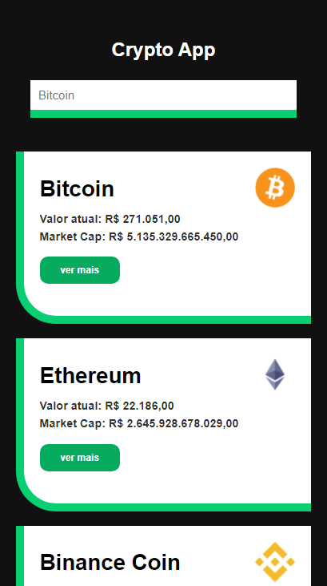
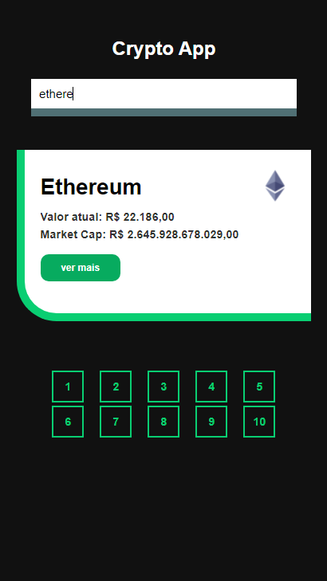
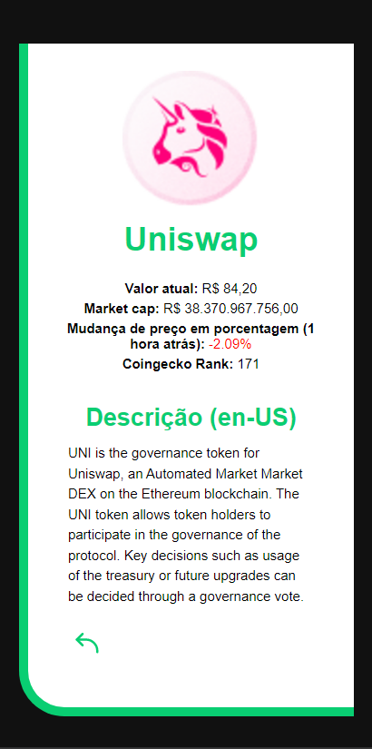

# Crypto App

## 📝 Sobre o Projeto
O projeto consiste em um website que retorna valores e informações de criptomoedas através de uma API externa. É possível ver as criptomoedas através de uma lista, ir para uma página individual de cada e verificar informações mais detalhadas e também realizar pesquisa de moeda por página através da barra de pesquisa no topo do site.

## ⚛️ Tecnologias Utilizadas
* React JS
* React Router Dom (v6)
* Fetch API

## 💽 Como Iniciar o Projeto
para baixar as dependências utilize `npm install`.  
utilize o comando `npm start` para inicializar.

## 💻 Preview do Projeto

## Listagem

## Pesquisa

## Página Individual
